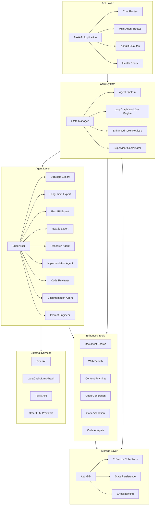
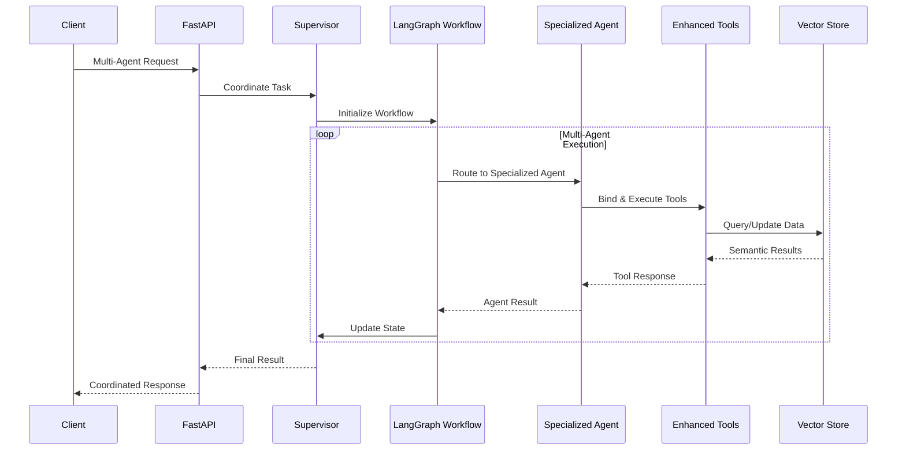
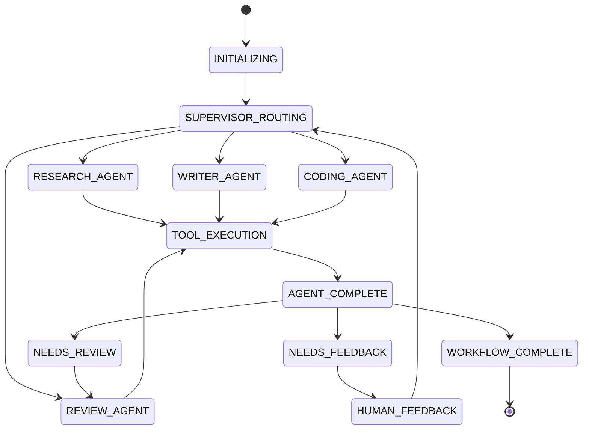
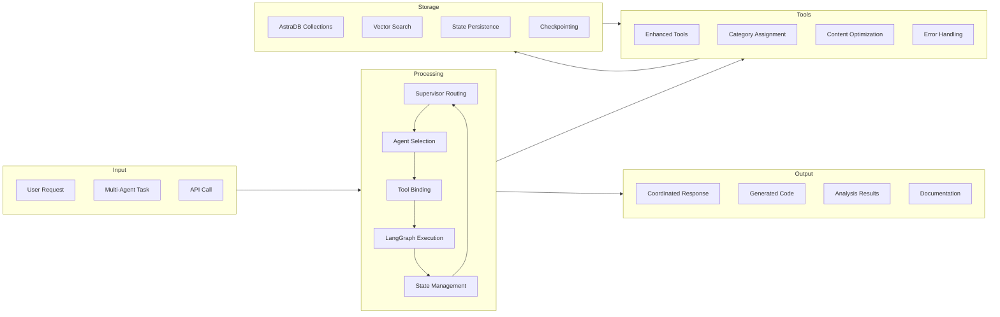
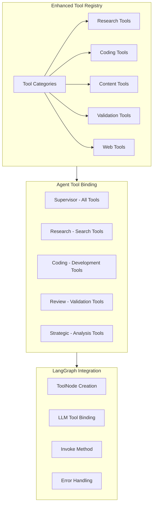
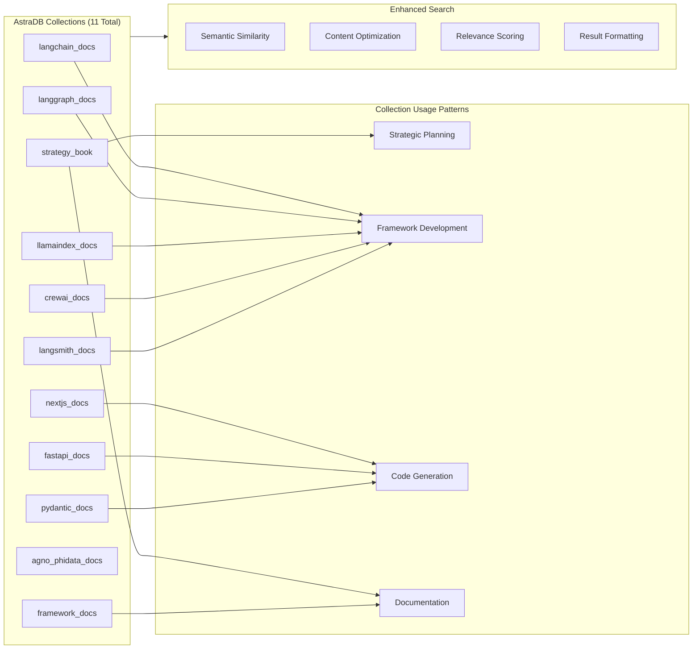
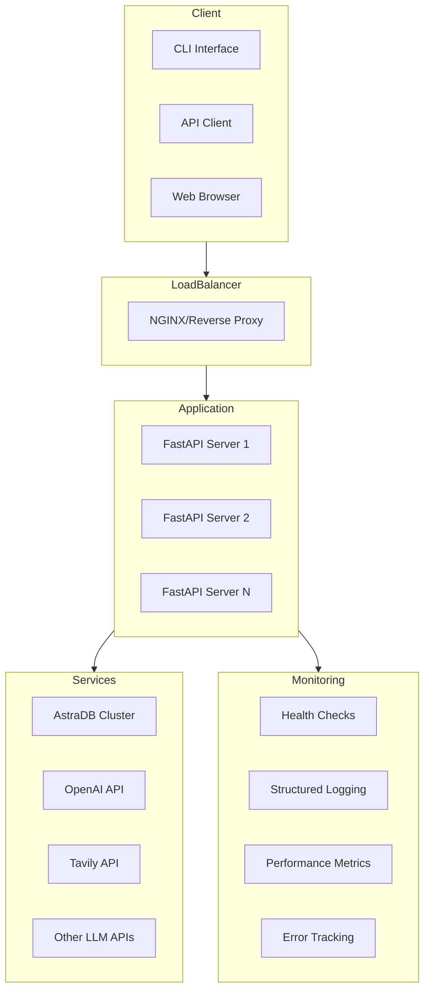
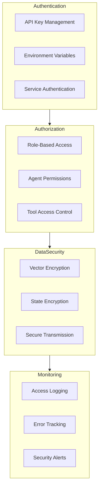
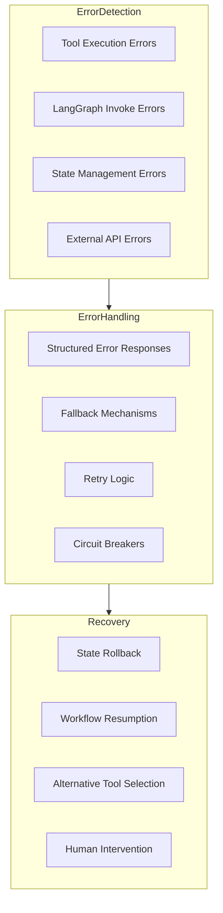

# Code Hero Architecture

## System Overview

## Enhanced Component Interactions

## LangGraph Workflow States

## System Components

### API Layer
- **FastAPI Application**: Modern async web framework with lifespan handlers
- **Multi-Agent Routes**: Coordination endpoints for complex tasks
- **Chat Routes**: Interactive agent communication
- **AstraDB Routes**: Vector database operations
- **Health Check**: System monitoring and status

### Core System
- **State Manager**: Persistent state with checkpointing support
- **Agent System**: 10 specialized agents with role-based tool binding
- **LangGraph Workflow Engine**: Multi-agent orchestration with proper invoke patterns
- **Enhanced Tools Registry**: 6 core tools with category-based assignment
- **Supervisor Coordinator**: Task routing and workflow management

### Agent Layer (10 Specialized Agents)
- **Supervisor**: Orchestrates workflows, manages task routing
- **Strategic Expert**: Strategic planning, decision-making, framework analysis
- **LangChain Expert**: LangChain development, chains, agents, workflows
- **FastAPI Expert**: FastAPI development, REST APIs, backend systems
- **Next.js Expert**: Next.js development, React components, frontend
- **Research Agent**: Information gathering, analysis, documentation search
- **Implementation Agent**: Code generation, implementation, development
- **Code Reviewer**: Code review, quality assurance, validation
- **Documentation Agent**: Documentation generation, technical writing
- **Prompt Engineer**: Enhanced prompt engineering using industry techniques

### Enhanced Tools System
- **Document Search**: Semantic search across 11 AstraDB collections
- **Web Search**: Real-time web search using Tavily API
- **Content Fetching**: Asynchronous web content retrieval
- **Code Generation**: Context-aware templates for FastAPI, Next.js, Python
- **Code Validation**: Comprehensive syntax and quality checking
- **Code Analysis**: Pattern detection, complexity analysis, quality metrics

### Storage Layer
- **AstraDB**: Vector database with OpenAI embeddings
- **11 Vector Collections**: Specialized knowledge domains
- **State Persistence**: Project, agent, and chat state management
- **Checkpointing**: LangGraph workflow state preservation

### External Services
- **OpenAI**: Primary LLM provider with embeddings
- **LangChain/LangGraph**: AI framework and workflow orchestration
- **Tavily API**: Real-time web search capabilities
- **Other LLM Providers**: Deepseek, Groq for diversity

## Enhanced Data Flow

## Tool Binding Architecture

## Vector Store Collections Architecture

## Deployment Architecture

## Security Architecture

## Performance Characteristics

### Scalability Metrics
- **Concurrent Agents**: 10 specialized agents
- **Tool Execution**: Parallel tool binding and execution
- **State Management**: Efficient persistence with checkpointing
- **Vector Search**: Optimized semantic similarity queries
- **Content Processing**: Automatic truncation for LLM efficiency

### Response Times
- **Agent Query**: < 2 seconds for simple queries
- **Multi-Agent Coordination**: 5-15 seconds for complex tasks
- **Vector Search**: < 1 second for semantic queries
- **Code Generation**: 2-5 seconds for template-based generation
- **Tool Execution**: Variable based on tool complexity

### Resource Usage
- **Memory**: Efficient state management with minimal overhead
- **CPU**: Optimized for concurrent agent execution
- **Network**: Batched API calls and content optimization
- **Storage**: Vector embeddings with efficient indexing

## Error Handling & Recovery

## Current Implementation Status

### ✅ Fully Implemented
- **Enhanced Tools System**: 6 tools with LangGraph integration
- **Multi-Agent System**: 10 specialized agents
- **State Management**: Full persistence and tracking
- **FastAPI Server**: Modern lifespan handlers
- **AstraDB Integration**: 11 collections with semantic search
- **Tool Binding**: Category-based assignment
- **Content Optimization**: Automatic truncation
- **Error Handling**: Structured responses

### ⚠️ Partially Implemented
- **LangGraph Workflows**: Implemented with invoke method compatibility issue
- **Streaming Responses**: Basic implementation, needs LangGraph fix
- **Checkpointing**: MemorySaver integration, depends on LangGraph

### 🎯 Future Enhancements
- **Advanced Streaming**: Real-time workflow updates
- **Enhanced Error Recovery**: Circuit breakers and retry mechanisms
- **Performance Optimization**: Caching and query optimization
- **Advanced Analytics**: Detailed performance metrics
- **Horizontal Scaling**: Multi-instance deployment

## Technology Stack

### Core Technologies
- **Python 3.8+**: Primary development language
- **FastAPI**: Modern async web framework
- **LangChain/LangGraph**: AI framework and workflow orchestration
- **Pydantic**: Data validation and serialization
- **AstraDB**: Vector database with DataStax

### AI/ML Technologies
- **OpenAI**: GPT models and embeddings
- **LangChain**: AI application framework
- **LangGraph**: Workflow orchestration
- **Vector Embeddings**: Semantic search capabilities

### Infrastructure
- **Uvicorn**: ASGI server
- **Async/Await**: Concurrent execution
- **Environment Variables**: Configuration management
- **Structured Logging**: JSON-based logging

This architecture provides a robust, scalable foundation for multi-agent AI workflows with proper tool binding, state management, and error recovery mechanisms. 