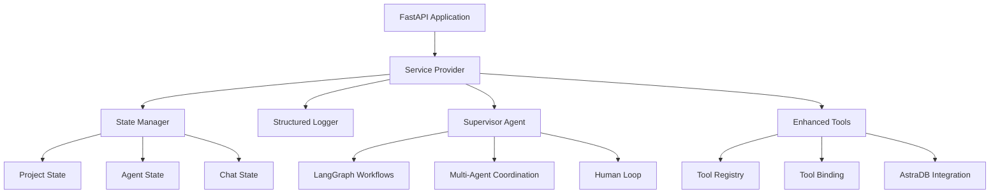

# Code Hero

A powerful AI-powered backend system for orchestrating multi-agent workflows with LangGraph integration, enhanced tools, and human-in-the-loop capabilities.

## Overview

Code Hero is designed to provide a robust foundation for building AI-powered applications that require:
- **Multi-agent orchestration** with LangGraph workflows
- **Enhanced tool binding** and invoke patterns
- **State management** with checkpointing
- **Workflow control** with error recovery
- **Human feedback integration** for complex decisions
- **Structured logging** and monitoring
- **Vector database integration** with AstraDB

## Architecture

The system follows a modular service-based architecture with LangGraph integration:



For detailed documentation on the service architecture, see [docs/services.md](docs/services.md).

## Key Features

### 🤖 **Multi-Agent System**
- **10 Specialized Agents**: Strategic, LangChain, FastAPI, Next.js, Research, Implementation, Code Review, Documentation, Prompt Engineering, Supervisor
- **LangGraph Integration**: Proper workflow orchestration with `invoke` method
- **Tool Binding**: Automatic tool assignment based on agent roles
- **State Management**: Persistent state with checkpointing

### 🛠️ **Enhanced Tools System**
- **6 Core Tools**: Document search, web search, content fetching, code generation, validation, analysis
- **Smart Categorization**: Tools grouped by function (research, coding, validation, web)
- **Content Optimization**: Automatic truncation for LLM efficiency
- **Error Handling**: Structured responses for workflow management

### 🔄 **Workflow Management**
- **Multi-agent coordination** with task routing
- **Error recovery** and retry mechanisms
- **Human feedback integration** for complex decisions
- **Streaming responses** for real-time updates
- **State persistence** with AstraDB

### 📊 **Monitoring & Logging**
- **Structured logging** with JSON format
- **Health monitoring** for all services
- **Performance metrics** and error tracking
- **Debug mode** with verbose output

### 🗄️ **Data Management**
- **AstraDB Integration**: 11 vector collections for specialized knowledge
- **Semantic Search**: Vector similarity with OpenAI embeddings
- **Document Processing**: Automatic chunking and indexing
- **Collection Management**: Organized by framework and domain

## Getting Started

### 1. **Environment Setup**

Create a `.env` file with required variables:

```bash
# Required
OPENAI_API_KEY=your_openai_api_key
ASTRA_DB_ID=your_astra_db_id
ASTRA_DB_REGION=your_region
ASTRA_DB_APPLICATION_TOKEN=your_token

# Optional
DEEPSEEK_API_KEY=your_deepseek_key
GROQ_API_KEY=your_groq_key
TAVILY_API_KEY=your_tavily_key
LANGCHAIN_API_KEY=your_langchain_key
```

### 2. **Installation**

```bash
# Install the package
pip install -e .

# Or install dependencies manually
pip install -r requirements.txt
```

### 3. **Quick Test**

```bash
# Test CLI
python -m code_hero --help

# List available agents
python -m code_hero list-agents

# Query an agent
python -m code_hero query-agent research "What are AI agent best practices?"

# Start the server
python -m code_hero run-server
```

### 4. **Multi-Agent Coordination**

```bash
# Coordinate complex tasks
curl -X POST "http://localhost:8000/multi-agent/coordinate" \
  -H "Content-Type: application/json" \
  -d '{
    "task_description": "research FastAPI best practices and generate a sample application",
    "project_id": "fastapi_project_001"
  }'
```

## Available Agents

| Agent | Role | Capabilities | Tools |
|-------|------|-------------|-------|
| **supervisor** | Orchestrator | Workflow management, task routing | All tools |
| **strategic_expert** | Strategist | Planning, decision-making | Research, analysis |
| **langchain_expert** | LangChain Dev | Chains, agents, workflows | Coding, validation |
| **fastapi_expert** | API Developer | REST APIs, backend development | Code generation, validation |
| **nextjs_expert** | Frontend Dev | React components, UI development | Code generation, web tools |
| **research** | Researcher | Information gathering, analysis | Search, web research |
| **implementation** | Developer | Code generation, implementation | Coding tools |
| **code_reviewer** | QA Engineer | Code review, quality assurance | Validation, analysis |
| **documentation** | Technical Writer | Documentation, content creation | Content, research |
| **prompt_engineer** | Prompt Expert | Enhanced prompt engineering | Research, content |

## Enhanced Tools

### Tool Categories

- **🔍 Research**: `search_documents`, `search_web`, `fetch_web_content`
- **💻 Coding**: `generate_code`, `validate_code`, `analyze_code`
- **📝 Content**: `generate_code`, `search_documents`
- **✅ Validation**: `validate_code`, `analyze_code`
- **🌐 Web**: `fetch_web_content`, `search_web`

### Tool Features

- **LangGraph Integration**: Proper tool binding with `invoke` method
- **Content Optimization**: Automatic truncation for LLM efficiency
- **Enhanced Validation**: Comprehensive code analysis with quality metrics
- **Smart Code Generation**: Context-aware templates for FastAPI, Next.js, Python
- **Error Handling**: Structured error responses for workflow management

## Project Structure

```
code-hero/
├── docs/
│   ├── services.md              # Service architecture
│   └── ...
├── src/
│   └── code_hero/
│       ├── main.py              # CLI and server entry point
│       ├── workflow.py          # LangGraph workflow engine
│       ├── supervisor.py        # Multi-agent coordinator
│       ├── tools.py             # Enhanced tools system
│       ├── agent_expert.py      # Agent implementations
│       ├── state.py             # State management
│       ├── manager.py           # State manager
│       ├── logger.py            # Structured logging
│       ├── config.py            # Configuration
│       ├── services.py          # Service management
│       ├── interfaces.py        # Service interfaces
│       ├── types.py             # Type definitions
│       ├── utils.py             # Utilities
│       ├── human_loop.py        # Human-in-the-loop
│       ├── context.py           # Context management
│       ├── chat.py              # Chat functionality
│       └── astra_db.py          # AstraDB integration
├── tests/
├── SETUP_CLI.md                 # Detailed setup guide
├── CHECKLIST.md                 # Implementation checklist
├── ARCHITECTURE.md              # System architecture
├── README.md                    # This file
├── setup.py
└── requirements.txt
```

## API Endpoints

### Core Endpoints

- `GET /health` - System health check
- `GET /api/astra/health` - AstraDB health check
- `POST /multi-agent/coordinate` - Multi-agent task coordination

### Agent Interaction

- `POST /chat` - Chat with agents
- `GET /agents` - List available agents
- `POST /agents/{agent}/query` - Query specific agent

### Document Management

- `GET /api/astra/collections` - List collections
- `POST /api/astra/search` - Search documents

## Usage Examples

### CLI Usage

```bash
# Interactive chat
python -m code_hero chat-mode --agent langchain_expert

# Document search
python -m code_hero search-docs "FastAPI middleware" --collection fastapi_docs

# Agent query with verbose output
python -m code_hero query-agent fastapi_expert "How to implement authentication?" --verbose
```

### API Usage

```bash
# Multi-agent coordination
curl -X POST "http://localhost:8000/multi-agent/coordinate" \
  -H "Content-Type: application/json" \
  -d '{
    "task_description": "generate a Next.js component with TypeScript and validate the code",
    "project_id": "nextjs_component_001"
  }'

# Health check
curl http://localhost:8000/health

# Document search
curl -X POST "http://localhost:8000/api/astra/search" \
  -H "Content-Type: application/json" \
  -d '{
    "query": "LangGraph best practices",
    "collection": "langgraph_docs",
    "limit": 5
  }'
```

## Development

### Running Tests

```bash
# Install dev dependencies
pip install -e ".[dev]"

# Run tests
pytest

# Run with coverage
pytest --cov=src/code_hero
```

### Development Setup

```bash
# Clone repository
git clone <repository-url>
cd code-hero

# Create virtual environment
python -m venv venv
source venv/bin/activate  # On Windows: venv\Scripts\activate

# Install in development mode
pip install -e .

# Set up environment variables
cp .env.example .env
# Edit .env with your API keys

# Test installation
python -m code_hero --help
```

### Contributing

1. Fork the repository
2. Create a feature branch: `git checkout -b feature/amazing-feature`
3. Make your changes
4. Run tests: `pytest`
5. Commit changes: `git commit -m 'Add amazing feature'`
6. Push to branch: `git push origin feature/amazing-feature`
7. Submit a pull request

## Troubleshooting

### Common Issues

1. **LangGraph Integration**: Ensure `langgraph` is installed and compatible
2. **AstraDB Connection**: Verify credentials and database status
3. **Tool Binding**: Check tool registry initialization
4. **State Management**: Verify state persistence and checkpointing

### Debug Commands

```bash
# Check configuration
python -m code_hero check-config

# Test tools
python -c "from src.code_hero.tools import tool_registry; print(tool_registry.list_tools())"

# Verbose logging
python -m code_hero query-agent research "test" --verbose
```

## License

MIT License - see LICENSE file for details

## Support

- 📖 **Documentation**: See `docs/` directory
- 🐛 **Issues**: Report on GitHub Issues
- 💬 **Discussions**: GitHub Discussions
- 📧 **Contact**: [Your contact information] 